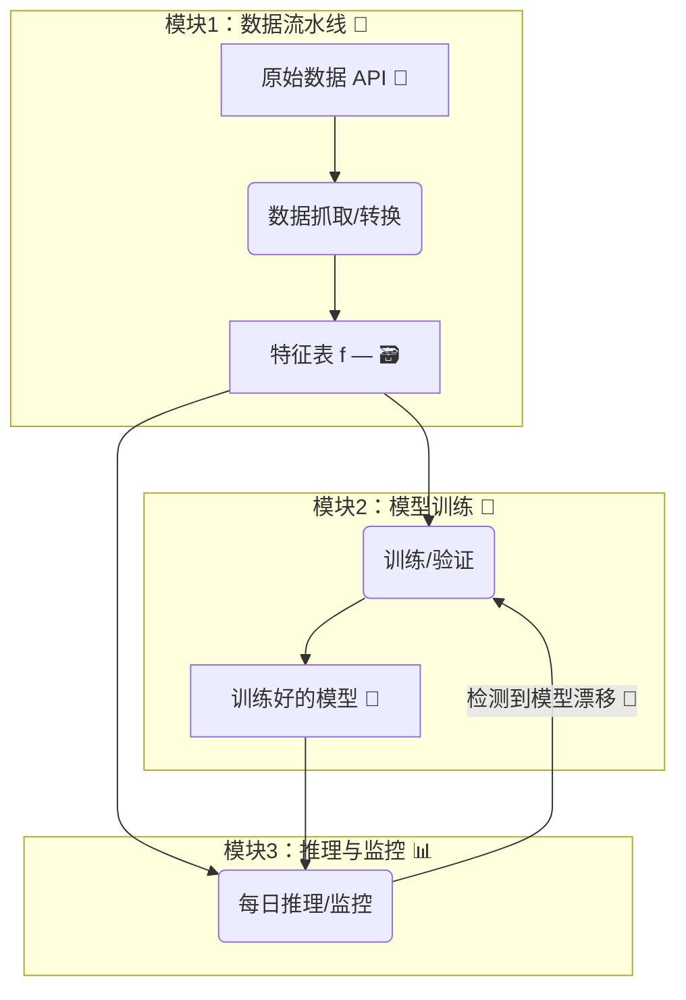

# 期权行情预测

```mermaid
flowchart TD
    subgraph "模块1：数据流水线 🌊"
        A[原始数据 API 📡] --> B(数据抓取/转换)
        B --> C[特征表 f — 🗃️]
    end

    subgraph "模块2：模型训练 🚀"
        C --> D(训练/验证)
        D --> F[训练好的模型 🤖]
    end

    subgraph "模块3：推理与监控 📊"
        C --> E(每日推理/监控)
        F --> E
        E -- "检测到模型漂移 🔄" --> D
    end
```
